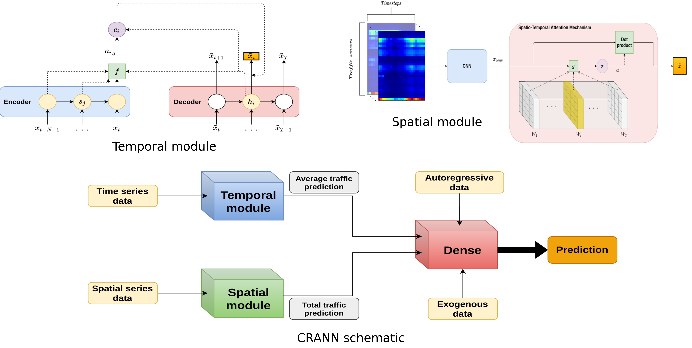

# A Spatio-Temporal Spot-Forecasting Framework for Urban Traffic Prediction

Official code for the paper A Spatio-Temporal Spot-Forecasting Framework for Urban Traffic Prediction

## Abtract
Spatio-temporal forecasting is an open field whose interest is growing exponentially. In this work we focus on creating a complex deep neural system for spatio-temporal traffic forecasting that, besides of performing better than other state-of-the-art models, shows to be adaptable over several spatio-temporal conditions while is easy to understand and interpret. For this purpose, in this paper we propose an attention-based neural network framework in which several modules are combined in such a way that key spatio-temporal time series components are taken into account while the processing of information by the network can be easily interpreted and tracked. Given that the concrete issue of traffic prediction is itself transcendental, we concentrate our efforts on it, but our system is easily extensible to any spatio-temporal problem.

## Model

## Requirements
* Python >= 3.6
* Pytorch >= 1.3.0

## Examples
There are exemplifications for each module for data in zone A through several jupyter notebooks. Although the training has been divided in three stages in order to parallelize, CRANN is easily extensible to only one general training.

## Data
Data consist in a 2-D tensor. Rows for time lags and columns for spatial points. 
